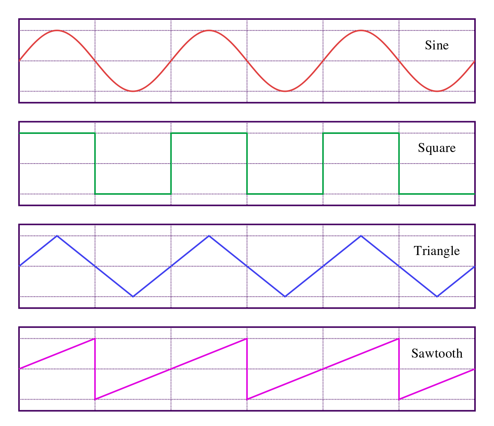

## Understanding Synthesizers

A synthesizer generates tones by generating an electrical signal that moves between high and low voltages in various patterns, and at different speeds. These signals can be sent to control various parameters of the sound output. 

Here is an example of a basic synthesizer:

We will dive into the specifics of it later in this chapter. Be sure to check your volume before clicking to avoid hearing discomfort.

{}

---

## Building a Synthesizer

To build a synth in Tone.js we need to use the `Tone.Synth()` object. By opening a set of braces inside of the object's parentheses we can specify various object parameters. The first one is the type of oscillator. We will go over the different type of oscillators later in the page. this is formatted just like `Tone.Players()` object from the previous page. 

Once we have made the synthesizer, we have to tell the computer how to trigger the sound. We can use `triggerAttackRelease()` to set these parameters. just like in the previous section we need to avoid triggering sounds in the `draw()` function; in the example below we use `keyPressed()`. 

`.triggeraAttackAelease()` has two main arguments:

* **Pitch**: given as a string. Indicates the desired keyboard note and octave to play on the `Tone.Synth()`.
* **Duration**: number of seconds the note sounds before at automatically stopping.

{}

### Notes and Octaves

In the above example the pitch A3 is used to show how to create a basic synthesizer in Tone.js. This refers to the pitch A in the third octave of a piano. The octave numbers change at every C on the keyboard.


A standard 88 key keyboard has a range from A0-C8.

---

## Oscillators

 The backbone of the `Tone.Synth()` object is its virtual oscillators. an oscillator moves back and forth between two points. By setting these points to be electric voltages and changing the pattern of how the computer moves from high-low-high, and how quickly this pattern occurs, the synthesizer is able to create its variety of timbres and pitches. These patterns are called waveforms.

### Types of oscillators

The most basic unit of synthesis in Tone is [Tone.Oscillator](https://tonejs.github.io/docs/r11/Oscillator), which is utilized inside of `Tone.Synth()`. There are 4 different kinds of waveforms.

* Sine
* Triangle
* Sawtooth
* Square



Each waveform is a representation of the transition between high and low voltages over time, and have a slightly different timbre. These forms are also representative of the patterns of air pressure that the sound creates. by increasing the wave frequency, the pitch increases, and increasing the amount of voltage will increase the sound amplitude.

### Changing The Oscillator Type

The example below generates the same pitches by pressing the row of number keys on the keyboard. you can change between the types of waveforms by pressing the buttons. The button functions update the .oscillator.type property of the `Tone.Synth()` object.

{}

### Partials

A partial, also sometimes called an overtone or harmonic, is a whole number multiple of the base frequency that makes up a sound. By adding and combining different partials, you can build custom timbres. To utilize a set of partials, you can specify their volume in an array;

```
osc = Tone.Synth({
    oscillator{
        type: Square
    }
});

osc.partials = [1, 0.5, 0.2, 0.05, 0.01];
```

These partials follow the natural harmonic series of the fundamental pitch that was fed into the `triggerAttackRelease()` method. For more information on the harmonic series, see the Resources section.

An [example](https://tonejs.github.io/examples/oscillator.html) of the Tone.js oscillator types with partials can be found here.

---

### Let's Practice!

In this lesson there were several sketches showing different synthesizers. Using them as a starting place can you create your own synthesizer?

Try making 2 different synthesizers that have unique sounds. Control one with on-screen buttons and the other with keyboard inputs.

Lastly, try adding a chan of at least 2 effects to each synthesizer. You can process these sounds in real-time just like we did in the last chapter!

---