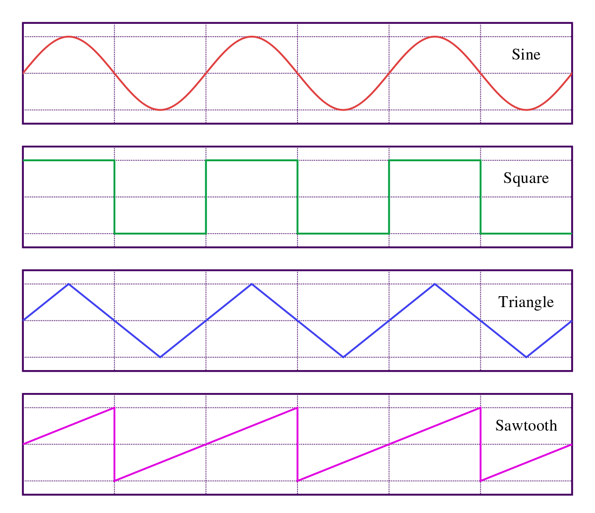

## Chapter 8 Review

Lets go over some of the basics from the previous lessons in this chapter. This is a large chapter, so lets take some time to go over everything in one place. Be sure to look back at the lessons, code examples, and Resources pages if you need more of a review before moving onto the next assignment.

---

## Making a Basic Synth

`Tone.Synth()` is the basic synthesizer object in the Tone.js library. We can use it to generate a simple sound with our computers. We can also utilize multiple `Tone.Synth()` objects, effects, and signal routing in order to create much more complex sounds. to create a synthesizer we need the following information:

* A place to store the synth with a name. (variable)
* Pitch for the synth to play.
* Trigger to play the pitch.

Once we make the `new Tone.Synth().toMaster()` we can give the synthesizer the remaining information as arguments to the `.triggerAttackRelease()` method.

---

## Pitches

In Tone.js pitches are determined by their musical note name and the octave on the keyboard that they are located. This gives each note a name like G2, B6, or Eb4. The higher the number, the higher the pitch. The octave number increases at every C note on a piano, and pianos have a range from A0-C8.

In terms of frequency, moving one octave will either double or halve the original frequency. Moving from A4 to A5 will double the frequency from 440Hz to 880Hz, and going form A4 to A3 will halve the value to 220Hz. This is true for all octave relationships. 

---

## Waveforms

Basic synthesizers create an electrical current that moves back and forth, or oscillates. When this electricity is converted into sound by the device's amplifier and speaker, it results in a unique timbre being output. These oscillations can occur in various patterns. The speed at which the oscillations occur determine the pitch being heard.



Each of the 4 main waveform types has a unique timbre. We can specify this timbre when we first crate the synthesizer using the JSON format.

```js
synth = new Tone.Synth({
    oscillator: {
        type: 'sawtooth'
    }
}).toMaster();
```

---

## ADSR

We can also specify how the synthesizer sounds beyond the general timbre. Each sound has an amplitude envelope, which determines how the loudness of different parts of the sound change over time. We can specify the duration of a note in the triggerAttackRelease() arguments, or the envelope. 

Each envelope contains 4 parts: Attack, Decay, Sustain, and Release. The attack is the initial beginning of the sound, followed immediately by a lowering of the sound volume. The sustain is how long the sound continues for before fading away in the release. 

By changing the durations of each of these values and how the computer ramps to them (linearly or exponentially), the types of sounds can be altered greatly without having to alter the waveform.

```js
synth = new Tone.Synth({
    oscillator: {
        type: 'sawtooth'
    }, 
   envelope: {
      attack: 0.05,
      decay: 0.5,
      sustain: 1,
      release: 1
    }
}).toMaster();
```

---

## Filters

Filters can be applied to sound in order to boost or lower certain frequencies. THere are different parameters to the `Tone.Filter()` object, which can all be adjusted through setting the properties, or in the JSON format like above when creating the object.

* cutoff frequency: frequency where the filter begins to take effect.
* type: specific frequencies the filter alters. Filter types can include:
  * lowpass: reduces frequencies above a cutoff point, letting the low frequencies pass through.
  * highpass: reduces frequencies below a cutoff point, letting the high frequencies pass through.
  * bandpass: reduces frequencies above and below a cutoff point, letting only a small band of frequencies pass through.
  * lowshelf: boosts or reduces only the low frequencies.
  * highshelf: boosts or reduces only the high frequencies. 
  * notch: the opposite of a bandpass filter. it allows all frequencies except those around a cutoff to pass through.
  * allpass: allows all frequencies to pass through.
  * peaking: boosts or removes frequencies around a center frequency to better isolate that frequency.
* rolloff: how much the sound volume is reduced by the filter in decibels.
* Q: how quickly the filter is applied to its frequency range

---

## LFO

A Low Frequency Oscillator behaves just like the oscillators used to generate sounds in Tone.Synth(), but with one main difference: the speed. LFOs generally move between their high and low values at a rate slower than humans can perceive at pitch. Because they can have unique waveform patterns and automatically transition  back and forth between states, LFOs are a perfect tool for automating the parameters of various effects and other objects. By changing the rate of the LFO, many interesting sounds can be generated. Simply connect the output of the LFO to the input of th parameter you wish to control. Below is an example from a code presented in the chapter of this connection.

```js
ampLfo.connect(osc.volume);
lfo2.connect(lowFilter.frequency);

highFilter.connect(ampEnv);
lowFilter.connect(ampEnv);

osc.connect(highFilter);
noise.connect(lowFilter);

```

---

## Noise

Noise is a sound with now definite pitch. its frequencies are randomly spread out throughout the human hearing spectrum at various proportions.. one effective way of making tones is to apply filters to noise in order to focus the frequencies onto one area. `Tone.Noise()` generates three main types of noise that can be routed to various places in the audio signal chain.

* white: all frequencies are present in equal proportions.
* pink: Higher frequencies are less present than lower frequencies. The rolloff is 3dB per octave. 
* brown: similar to pink noise, but with a steeper rolloff of 6dB per octave.

---

## Sequences

Tone.js can automatically sequence through musical events with the use of the `Tone.Transport()` object: an internal clock used to control planned events.
There are several steps to making a sequence that are listed in detail [on this page](https://pdm.lsupathways.org/3_audio/2_synthsandmusic/2_lesson_2/buildingasequence/).

Some things you need to remember are:

* You can control the speed of the transport clock, but this will affect all sequences in your code.
* You can store the notes you wish to play inside of an array. This array can be updated or replaced at various times.
* Transport can be used to schedule large scare events as well.

### Higher Level Even Scheduling

`Tone.Event()` is used to define musical events that we can schedule to occur at certain times with the transport. By specifying where in the transport we want the event to occur, we can program repeating events. We can even change the probability of these events occurring in order to make the results a little random!

We can also combine multiple events into the `Tone.Part()` object. We can list multiple event parameters within an array and load them into a single part which can be looped or altered just like a single event. Parts are great for scheduling chord progressions and the like.

---

## Scheduling Signals

We can utilize the transport's clock in order to plan out changes in various values and parameters for the various objects utilized in out codes. We can set these changes to occur automatically on on some sort of command with methods such as `setValueAtTime()` and `rampTo()`. 

When discussing the timing of these events, it is important to know the ways that Tone refers to time. 

* in seconds as numbers
* in measures and subdivisions as strings of numbers
* in musical beats and measures as text strings

Adding `+` to any times given in Tone will schedule an event for that duration of time in the future.

---


## Chapter 8 Review Assignment

For extra practice, try creating a code with two different synthesizers. 

1. The first synthesizer should play different notes based on user inputs such as keystrokes or pressing buttons.
2. The second synthesizer should play sequences of notes that automatically change after a given amount of time. 

The goal is to combine both synthesizers and sequencing of multiple scales into one cohesive assignment before moving onto the chapter assignment: creating a sound event.

Below is a potential working version of this assignment. Feel free to take inspiration from any of the synthesizers and techniques shown throughout chapters 7 and 7, but keep in mind that all work should be your own. Don't just copy what was shown in the textbook.

